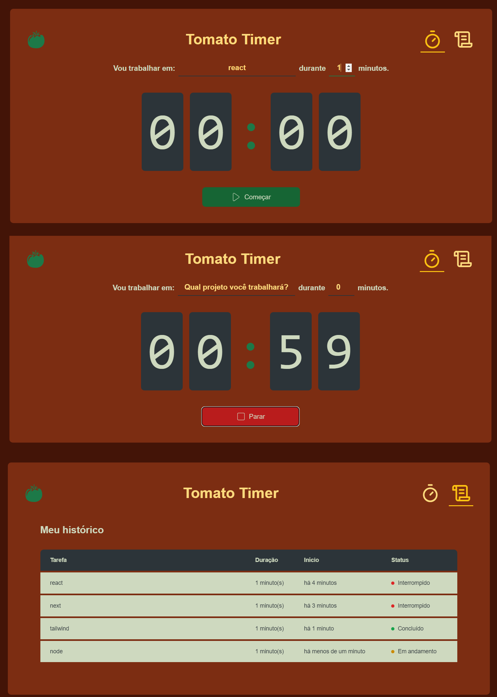

# Tomato Timer 🍅
Projeto consiste em um timer, que salva seus ciclos no localstorage, e lista em /history cada um dos ciclos, seu status, data que foi criado, entre outras informações.

## Para iniciar o projeto:
- Clone o repositório
- Use o comando 'npm install', depois 'npm run dev'
- Acesse http://localhost:3000/

### Tecnologias utilizadas
- React + TypeScript
- Next.js
- TailwindCSS
- Libs: date-fns, zod, react hookform

## Contato

E-mail:

sguedes.victor@gmail.com

LinkedIn:
https://www.linkedin.com/in/victorsilvaguedes/
